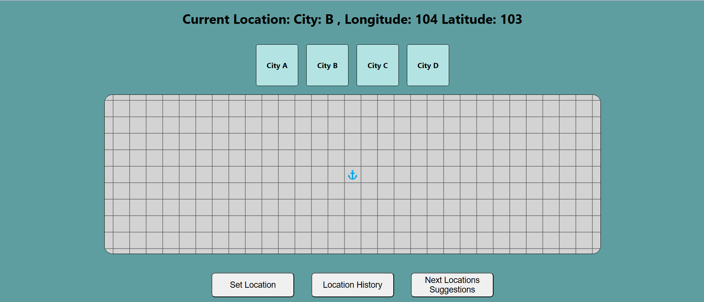
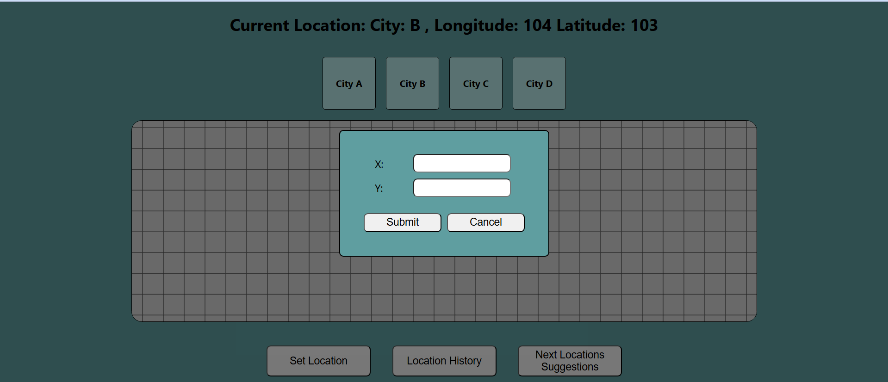
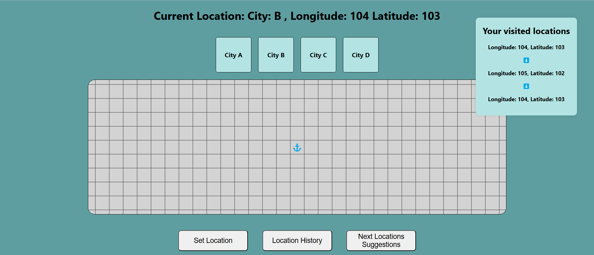
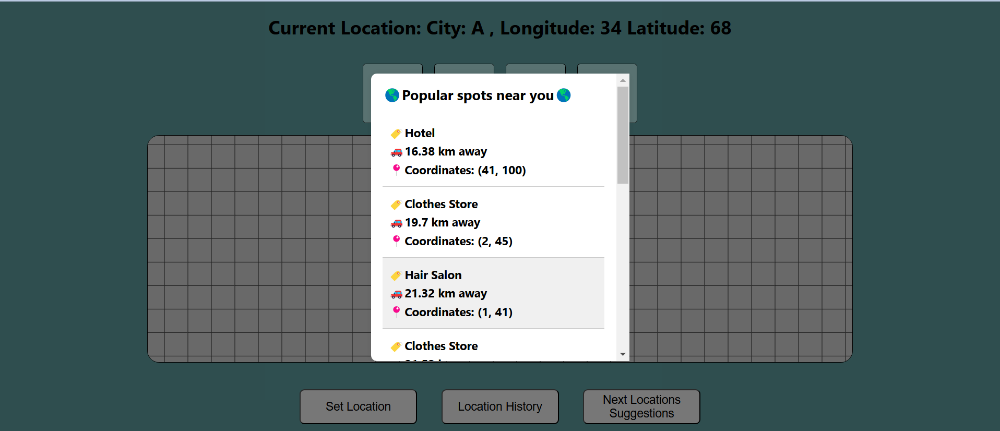

# sc4020 task 3 group 23

# task 3 requirements: define an app (e.g., predict next location) based on datasets & give solution

**POI Path Finder** - a location-based app developed to improve users' navigation experiences by giving POI suggestions within a particular city, based on users' navigation history. POI Path Finder uses datasets of users' present location and also past navigation history to give recommendations for next POI to go.

**How App Works** - User can select 1 out of 4 cities (A,B,C,D) - User then sets their current location on map of selected city (set with X/Y Coordinates) - App keeps track of User's past history of POI visited in selected city - App recommends the next best POI for User to go, based on User's profile and history

### Main UI

### Coordinate Box

### Location History

### Suggestion List

**App's Structure** - Frontend - Developed using React; - Backend - Developed using Flask

**Requirements to Run App** - Node.js installed; Flask installed

**Steps to Run App** - Clone Repo - cd to respective front/backend repo's directory - npm start to run frontend server - python main.py to run backend server